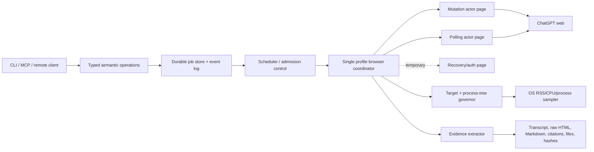

# Current ChatGPT Web Parity and Reliability Plan

**Date:** 2026-08-10
**Repository:** `kmccleary3301/oracle`
**Upstream reference:** `steipete/oracle` at `5941f0839762b00601ab26895162c096dd0ee9d` (`0.17.2`)
**Local baseline:** `0.17.1` plus the browser-control suite

## Decision

The north star is viable if “perfectly reliable” means **bounded, observable, recoverable, and never silently wrong**. Literal perfect availability is impossible when the transport is an undocumented, changing web UI behind account limits, experiments, authentication challenges, and service failures.

The CLI should therefore guarantee its own behavior:

1. Never report a send, upload, cancellation, model choice, or answer as successful without evidence.
2. Never blindly repeat a mutation after an acknowledgement is lost.
3. Preserve exact prompts, files, assistant Markdown, artifacts, state transitions, and failure evidence.
4. Bound browser tabs, Chrome process-tree memory, request memory, disk usage, and remote task admission.
5. Recover automatically when recovery is unambiguous; otherwise stop in a precise `requires_action` or `*_unknown` state.
6. Keep the public API semantic and stable. Do not expose raw Playwright selectors or arbitrary browser scripting as the product interface.

At plan inception, the fork was a useful prototype rather than this bounded system. Upstream supplied selector and lifecycle fixes but no hidden resource governor or process-memory solution; the local fork was already ahead in browser control and remote-tab hygiene. The implementation tranches below are now complete locally. The authenticated personal/project matrix passed on 2026-08-12 against the current ChatGPT web app. Promotion remains evidence-gated on three qualified eight-hour soak runs and a signed macOS/Linux/Windows release matrix from the exact release commit.

### Claim policy

- **L0 observed:** one dated repository, documentation, or live-UI observation.
- **L1 fixture-conformant:** deterministic fixtures plus one pinned live scenario.
- **L2 scoped parity:** representative positive, negative, and resource cases pass for a named account/plan/browser/locale matrix.
- **L3 operationally supported:** rolling probes, bounded resources, safe reattach, exact failure classification, and independent review pass for that matrix.
- **L4 broad confidence:** repeated runs across several supported cohorts pass. This remains a measured reliability statement, not a universal guarantee.

No capability is called complete without its matrix and evidence manifest. A change in UI fingerprint, plan/workspace, locale, browser, or official behavior expires the relevant live evidence.

## Immediate conclusions

- **Do not merge upstream wholesale.** Rebase regularly and cherry-pick/reconcile browser fixes by behavior. Upstream’s current tip is mainly dependency/release maintenance and has no RSS, heap, freeze, discard, or hard tab-budget implementation.
- **Do not increase concurrent tabs.** Replace “one long-lived tab per job” with a durable scheduler and a tiny browser actor pool.
- **Default to two Oracle-managed ChatGPT pages, hard ceiling three.** One mutation/submit actor, one read/poll actor, and one temporary recovery/auth slot. Only one actor may mutate ChatGPT at a time.
- **Treat submitted work as remote work only after proving it.** A task may release its page after Oracle has durable evidence that ChatGPT accepted the turn and the conversation can be reopened. Each workflow is classified as `resident_until_accepted`, `server_backed`, or `resident_until_complete` from live evidence.
- **Use one browser/profile owner.** Multiple CLI processes submit durable jobs to one coordinator instead of each launching or attaching independently.
- **Use OS process-tree accounting for memory.** CDP exposes target lifecycle, CPU time, runtime metrics, and DOM counters, but not total Chrome RSS. Page freezing is not a resource-enforcement mechanism and can suspend callbacks needed by the workflow.
- **Keep CDP/Puppeteer as implementation details.** Playwright may be used as an external E2E oracle, but adding another production browser ownership layer would increase lifecycle ambiguity and memory.
- **Fix resource ownership before adding more ChatGPT features.** Current cleanup and recovery paths can orphan Chrome, delete a live profile, lose registry updates, or declare a lease released when persistence failed.
- **Current authenticated evidence is green.** `.oracle-benchmarks/authenticated-workspace-matrix.json` records a signed-in Pro profile, 24 browser-authenticated projects, successful project-list and project-get paths, account-selector visibility, and current file/image controls. Project discovery uses the current paginated sidebar endpoint behind the existing evidence adapter, with button-based DOM extraction as a fallback.

## Baseline at plan inception: useful capabilities and material gaps

### Capabilities already present

The CLI currently exposes:

- Chat create, inspect, follow-up turn, artifact extraction, guarded move/delete, and visible-control inspection.
- Model selection and ChatGPT thinking/effort selection.
- Deep Research activation and long-running answer recovery.
- Local attachments, inline text, browser uploads, ZIP/text bundles, and sandbox artifact downloads.
- Image generation, image editing, and generated-image downloads.
- Project create/list/get/rename, conversation moves, and project-source list/add.
- Durable jobs with status/events/result/cancel/recover commands.
- Persistent manual-login profiles, copied profiles, local/remote Chrome, session artifacts, reattach hints, profile locks, tab leases, and limited tab pruning.
- Broad browser unit coverage and authenticated live smokes.

### Reliability gaps found in source

These are blockers, not polish:

1. **Unexpected CDP disconnect can orphan Chrome.** `src/browser/index.ts:2695-2839` skips `chrome.kill()` when the connection closed unexpectedly, yet removes a non-manual temporary profile. A live Chrome can remain without usable ownership metadata.
2. **Signal recovery is not an ownership protocol.** `src/browser/chromeLifecycle.ts:145-200` intentionally leaves an in-flight Chrome running after SIGINT/SIGTERM. SIGKILL/OOM has no hook. There is no independent reconciler that must claim or terminate the orphan.
3. **Lease correctness is weak.** `src/browser/tabLeaseRegistry.ts` has no heartbeat or owner generation; a six-hour run can be treated as stale. Its directory lock can be forcibly removed after ten seconds while the holder is still alive, and release errors are swallowed before a success log.
4. **Remote tab admission races.** `src/browser/remoteChromeTabs.ts` performs unlocked read/modify/write tracking and prunes before opening. Concurrent callers can exceed the target budget or lose records.
5. **Reattach can have multiple winners or leak launches.** `src/browser/reattach.ts` has no durable single-winner claim. Cleanup is established only after substantial setup, and successful setup followed by a wait/extraction error is not guarded by a `finally` covering every exit.
6. **Health checks accept contradictory evidence.** `src/sessionManager.ts:722-745,954-1017` returns early while a worker PID is live and considers either a live Chrome PID or an open port sufficient. Controller-alive/browser-dead and controller-dead/browser-orphaned states can remain “running.”
7. **Session updates lack cross-process compare-and-swap.** Concurrent attach/recover/status operations can overwrite metadata fields. Recovery itself has no claim lock.
8. **Remote uploads multiply memory.** The client reads files, base64-encodes them into JSON, the server buffers the whole request, parses it, then decodes more buffers. The nominal 512 MiB attachment budget can produce well over 1 GiB of transient memory.
9. **No resource telemetry or enforcement.** There is no Chrome process-tree RSS, child count, CPU slope, renderer crash, heap, DOM-counter, or hard request-memory budget.
10. **The historical North Star score is not evidence.** Its unsupported `1000/1000` claim conflicted with later unresolved attachment, image, OTP, Ubuntu, and reliability notes. The [North Star plan](chatgpt-browser-control-north-star-plan.md) now uses bounded capability/conformance ledgers instead.
11. **The prior timeout documentation drift is reconciled.** The current browser response default is 90 minutes, with 60-second input and 45-second attachment defaults; Deep Research uses a separate 40-minute default, and manual login retains a separate 20-minute headful wait cap. Browser-mode and configuration docs now state these values.

### Current contract is too small

`src/browser/chatgpt/types.ts` reduces a turn to `completed | submitted | failed` and snapshots primarily to turns, images, and sandbox artifacts. That cannot faithfully represent:

- upload accepted versus upload pending/failed;
- prompt accepted versus acknowledgement lost;
- streaming, tool use, Work, Deep Research planning, or waiting for confirmation;
- rate limit, quota exhaustion, policy refusal, login/Cloudflare challenge, or service error;
- external/manual conversation mutation and branch ancestry;
- requested, observed, and effective model/effort separately;
- cancellation requested, confirmed, rejected, or unknown;
- citations, apps, sources, writing/code blocks, and download provenance.

## Current ChatGPT web capability taxonomy

The web product is moving faster than the fork. As of this plan, the important surface is:

| Area                   | Current web behavior                                                                               | Oracle state                                                          | Target priority        |
| ---------------------- | -------------------------------------------------------------------------------------------------- | --------------------------------------------------------------------- | ---------------------- |
| Chat                   | New/resumed conversations, model/effort selection, search, attachments, rich responses             | Partial                                                               | P0                     |
| Work                   | Replaces agent mode for long multi-step tasks and deliverables; cloud tasks continue in background | Missing as a first-class mode                                         | P0                     |
| Deep Research          | Plan review/edit, source selection, progress, interruption, apps, cited downloadable reports       | Submission/result partial; plan/source/interrupt semantics incomplete | P0                     |
| Files/data             | Documents, spreadsheets, presentations, images, analysis, downloads, dynamic quotas                | Uploads exist; fidelity/quota/large-file semantics incomplete         | P0                     |
| Images                 | Generate, edit, selection/aspect workflow, undo/redo, image library                                | Generate/edit/download partial                                        | P0 then P1             |
| Projects               | Chats, project memory/instructions, sources, sharing, branching, moves, deletion                   | Core project/source operations partial                                | P0 then P1             |
| Search                 | Search mode, query rewrites, inline citations and source panel                                     | Generic answer capture only                                           | P1                     |
| Apps/connectors        | Read and write actions, source selection, approvals, workspace/region variability                  | Missing                                                               | P1                     |
| Writing/code blocks    | Edit, preview/run where available, save/download                                                   | Generic DOM/artifact capture only                                     | P1                     |
| Branch/history         | Branch from a message, parent lineage, pin/filter/search/archive/delete                            | Archive/move/delete partial; ancestry and branching missing           | P1                     |
| Scheduled tasks        | Once/repeat/schedule/trigger/monitor, progress and approvals                                       | Missing                                                               | P2 after job semantics |
| Temporary chat         | Distinct retention/history semantics                                                               | Missing                                                               | P2                     |
| Voice/desktop-local    | Live voice and desktop permissions                                                                 | Outside browser CLI scope                                             | Explicit non-goal      |
| Account/settings/admin | Plan, storage, data controls, RBAC                                                                 | Read-only diagnostics only where necessary                            | Explicit non-goal      |

The taxonomy is discovered at runtime. Plan, workspace, region, account experiments, selected model, and rollout can all change which controls exist. “Unsupported” is a valid, evidence-backed result; guessing is not.

## Target architecture



### 1. One coordinator per browser profile

The coordinator is the only process allowed to:

- launch or adopt the managed Chrome;
- create, attach, navigate, close, or replace Oracle-owned targets;
- mutate the ChatGPT composer;
- approve expected non-consequential UI prompts;
- update profile, target, job, and resource state.

CLI and MCP commands become clients. A direct one-shot can start the coordinator on demand, submit a job, and optionally wait. If the coordinator dies, a new process must win a durable generation/epoch claim before touching the browser.

Use Node’s built-in `node:sqlite` with WAL and short transactions for coordinator state. The project requires Node 24+, so this avoids another native dependency. Keep large request bodies and artifacts on disk, not in database rows.

Minimum tables:

- `profiles(profile_id, path, generation, owner_pid, owner_start_token, browser_pid, devtools_endpoint, state, heartbeat_at)`
- `targets(target_id, profile_id, generation, role, owner_job_id, state, url, created_at, last_seen_at)`
- `jobs(job_id, operation, state, reason_code, request_hash, conversation_id, expected_head, owner_generation, timestamps, retry_policy)`
- `job_events(job_id, sequence, state, reason_code, evidence_path, timestamp)`
- `attachments(job_id, path, size, media_type, sha256, remote_file_id, observed_state)`
- `artifacts(job_id, kind, source_url, path, size, sha256, turn_id)`
- `rate_limits(account_scope, feature_scope, model_scope, cooldown_until, source, evidence_path)`
- a bounded/downsampled `resource_samples` table or line log.

Every write uses a transaction and monotonic job event sequence. Every state transition checks the expected prior state and owner generation.

### 2. Tiny actor pool, not one tab per job

Default limits:

- one managed Chrome process/profile;
- two normal Oracle-owned ChatGPT page targets;
- three page targets as an absolute ceiling, including temporary recovery/auth work;
- one concurrent mutating UI operation;
- configurable remote accepted-task limit, initially four, independent of resident page count;
- no automatic creation of a second managed profile.

Page roles:

1. **Mutation actor:** navigate, configure mode/model, upload, verify, submit, and capture acceptance evidence.
2. **Polling actor:** rotate through accepted conversations to update remote status and extract completed output.
3. **Recovery/auth slot:** created only when a known flow needs it; it must replace an idle page or be destroyed immediately after use.

A job owns an actor only while a UI transaction is active. After accepted submission, Oracle records the conversation and user-turn identity, navigates the actor away, and polls later **only for workflows proven to continue server-side**. Work and cloud-browser tasks are documented to continue in the background, but Oracle must run the same live eviction/resume experiment for Chat, Deep Research, images, and each newly supported mode.

If a workflow requires page residency, the scheduler marks it `resident_until_complete`, counts it against the two-page budget, and queues later work.

### 3. Resource governor

Resource enforcement uses complementary signals:

- OS process tree rooted at the owned Chrome PID: RSS/working set, CPU delta, process count, command line, parentage, and start identity;
- CDP `Target` lifecycle: created/destroyed/crashed/detached targets and exact target count/type;
- CDP `SystemInfo.getProcessInfo`: process types and CPU-time deltas, not memory;
- per-page runtime heap/DOM counters as diagnostic leading indicators;
- job progress timestamps, upload bytes, artifact bytes, and disk spool size.

Do not use `Page.setWebLifecycleState(frozen)` as a primary control. Frozen pages suspend timers and callbacks and may make a healthy workflow appear stalled. Do not rely on `chrome://discards`; it is diagnostic, not a stable control API.

Initial configuration surface:

```text
browser.maxPages = 2
browser.hardMaxPages = 3
browser.maxMutations = 1
browser.maxAcceptedRemoteTasks = 4
browser.rssSoftLimit = 4 GiB emergency release default
browser.rssHardLimit = 6 GiB mandatory owned-tree shutdown
browser.rssResumeLimit = 3 GiB hysteresis threshold
browser.recycleAfterJobs = measured, not guessed
browser.recycleAfterAge = measured, not guessed
browser.spoolDiskLimit = explicit
browser.maxRequestBytes / maxAttachmentBytes / maxAttachmentCount = explicit
```

The owned Chrome process tree is sampled every second in production. The 4/6/3 GiB thresholds are conservative safety defaults selected after measured isolated baselines of 0.73–0.92 GiB and an observed 27 GiB runaway; a hard breach fails the browser run and terminates only an identity-verified owned tree. Promotion still requires Chat, Work, Deep Research, image, and large-file calibration on macOS, Linux, and Windows before tightening or raising these limits.

Actions:

- **Soft watermark:** stop admitting UI mutations, close unowned/idle Oracle pages, evict server-backed jobs, purge completed downloads from page state, and schedule a browser recycle.
- **Hard watermark:** stop admission immediately. If all active jobs are durably accepted/server-backed, gracefully close and restart Chrome. If a resident transaction is in progress, allow a short bounded grace; then mark it `resource_exhausted_unknown`, preserve evidence, and terminate the owned process tree.
- **Remote/adopted Chrome:** Oracle may close only its own targets and detach. It must not kill a browser it does not own. Return `resource_exhausted` if target cleanup cannot restore the budget.
- **Cleanup:** `Browser.close` or the owned launcher shutdown, wait for process-tree exit, then TERM/KILL descendants only after validating profile path, process start identity, and generation. Never trust a PID alone.

### 4. Stream attachments and artifacts

Replace base64-in-JSON remote uploads with bounded streaming multipart or a two-step spool protocol:

1. Validate declared count and `Content-Length` before body read.
2. Stream each part to a job-scoped temporary file while hashing and enforcing decoded byte limits.
3. Fsync/close, then atomically publish the spool manifest.
4. Pass local paths to the browser file input; do not load whole files into JavaScript or Node memory.
5. Delete spools after a terminal state and retention window.

Match observed ChatGPT limits without converting them into memory limits. Current official limits include 512 MiB/file, 20 MiB/image, about 50 MiB for spreadsheets depending on rows, 2M tokens for text/documents, dynamic upload-rate limits, and shared storage caps. Large supported files must stream; unsupported or over-limit files fail before ChatGPT is mutated.

Record for every file: source path, display name, bytes, MIME, SHA-256, upload attempt, observed UI label, remote ID if observable, and post-send association with the user turn.

### 5. Versioned UI capability adapter

The public commands call semantic operations such as:

```text
chat.create
chat.turn
chat.branch
chat.snapshot
work.start
work.answer_question
research.start
research.approve_plan
research.interrupt
image.generate
image.edit
project.source.add
artifact.download
```

Each operation has a versioned UI adapter that:

- probes capabilities and visible controls before mutation;
- records a sanitized page fingerprint, locale, account/workspace, observed labels, and selector evidence;
- prefers stable roles, accessible names, test IDs, control relationships, and state transitions;
- keeps multiple independently evidenced selectors only where necessary;
- rejects ambiguous matches instead of picking the first plausible element;
- centralizes modal/popover/dialog handling;
- returns `unsupported` when the current account/UI lacks the feature.

Add `oracle browser probe --json` as a read-only capability inventory. The probe must redact prompts, conversation titles, account identifiers, and private content while retaining structural evidence.

### 6. Job and session state machine

Replace broad statuses with states that preserve what is known:

```text
queued
admission_blocked
acquiring_browser
navigating
capability_check
preparing
uploading
upload_verifying
ready_to_submit
submitting
submission_unknown
submitted
waiting_remote
waiting_for_plan_approval
waiting_for_user_input
waiting_for_confirmation
polling
extracting
completed
rate_limited
quota_exhausted
conflict
login_required
challenge_required
resource_exhausted
cancel_requested
cancel_unknown
cancelled
failed_retryable
failed_permanent
requires_action
```

Every state has a stable `reason_code`, human message, timestamps, and evidence reference. `status --json` returns requested, observed, and effective model/mode/effort independently.

#### Submission idempotency

Before typing:

- capture conversation ID/URL, ordered turn identities, latest user/assistant hashes, composer state, and expected head;
- compare against the job’s expected conversation revision;
- fail `conflict` if another CLI, browser, device, or person changed the conversation.

Before clicking Send, repeat the revision check and verify exact composer text plus every attachment.

After clicking Send, require acceptance evidence: a new user turn associated with the expected prompt/file hashes, a captured conversation identity, and a stable transition out of the composer. If CDP disconnects after the click but before evidence is durable, enter `submission_unknown`. Never retry immediately.

Reconciliation reopens the conversation and searches for an exact compatible user turn:

- unique match: commit `submitted`;
- no match and unchanged expected head: safe retry may be allowed by policy;
- multiple matches or changed head: `requires_action`/`conflict`.

This provides exactly-once behavior when observable and safe at-most-once behavior when acknowledgement is lost. It deliberately refuses to manufacture certainty.

#### External/manual divergence

Each append operation declares a policy:

- `fail` (default): require the exact expected head;
- `append-latest`: explicitly accept the latest branch;
- `branch`: create a new branch from an explicit parent turn;
- `new-chat`: preserve the original and start cleanly.

Oracle never silently appends to a changed conversation.

#### Cancellation

`cancel` first writes `cancel_requested`. It releases no lease and frees no remote-capacity slot until the underlying state is reconciled.

- queued job: cancel transactionally;
- pre-submit UI work: abort and verify composer/upload cleanup;
- accepted generation/task: use the visible Stop/interrupt control and confirm the resulting state;
- lost tab or ambiguous stop: `cancel_unknown`, then reconcile;
- completed-before-stop: complete normally and report the race.

### 7. Exact output and artifact preservation

For each assistant turn store:

- conversation, branch/parent, turn, and message identities when observable;
- raw sanitized HTML snapshot for forensic/debug use;
- copy-control Markdown as the preferred text representation;
- DOM text and structured blocks as independent cross-checks;
- citations, source URLs, app/tool activity, code/writing blocks, tables, and status/error banners;
- requested/observed/effective model and effort;
- artifact URLs, downloaded bytes, local path, size, MIME, SHA-256, and originating turn;
- capture method, adapter version, page fingerprint, and confidence/evidence.

Completion requires explicit state evidence plus stability across successive polls. “Stop button disappeared” alone is insufficient. An assistant error turn, rate-limit banner, policy refusal, or interrupted tool run is a terminal outcome with its own reason, not an empty successful answer.

### 8. Rate limits, quotas, and admission

Static documented quotas are hints, not truth. ChatGPT limits vary by plan, workspace, feature, model, region, and peak load.

Maintain independent scheduler lanes for account + feature + model. Sources of truth, in order:

1. explicit UI usage counter or cooldown;
2. visible rate/quota error and retry time;
3. observed network status/retry metadata when safely accessible;
4. conservative local history.

Only safe reads/polls use automatic jittered backoff. A mutation retries only after reconciliation proves it was not accepted. Pause only the affected lane; continue unrelated work when the account UI proves it is safe.

### 9. Dialogs, confirmations, authentication, and Cloudflare

Centralize overlays into a typed interrupt stream:

- expected benign notice;
- destructive confirmation;
- consequential Work/app action approval;
- login/OTP;
- Cloudflare/CAPTCHA;
- rate limit/quota;
- unsupported feature or workspace policy;
- unknown blocking overlay.

Auto-dismiss only explicitly allowlisted, reversible notices. Never auto-approve deletion, external side effects, credentials, payments, sharing, or an unknown dialog. Preserve the tab, screenshot/sanitized DOM evidence, and return `requires_action` with a resume command.

Headless mode is best-effort. The current authenticated smoke reached Cloudflare under some fresh headless profiles. The supported recovery path is a persistent profile plus a headful/manual challenge handoff, followed by verified headless reuse when the site permits it.

## Public CLI/MCP contract

Prefer a small number of composable nouns and typed JSON over a flag explosion:

```text
oracle chat create|turn|get|branch|move|archive|delete
oracle work start|status|answer|approve|interrupt
oracle research start|plan|get|interrupt|download
oracle image generate|edit|get|download
oracle project create|get|list|rename|delete|share
oracle project source add|list|remove
oracle task create|get|list|pause|resume|delete
oracle job start|status|events|tail|result|cancel|recover
oracle browser probe|status|resources|tabs|doctor|login
```

Rules:

- human text on stderr; machine result on stdout with `--json`;
- every mutation supports `--dry-run` where the UI permits a meaningful preview;
- destructive or consequential operations require exact typed confirmation or an approval token;
- all long operations return a job ID and are attachable;
- every command documents terminal states and exit codes;
- MCP uses the same service methods and schemas, not a separate implementation;
- no arbitrary CSS selector, JavaScript, or Playwright-eval command in the stable API.

## Execution plan

Each tranche is independently reviewable and promoted only after its gate passes. Do not add new parity features while the reliability foundation is red.

### Tranche 0 — Establish truthful baselines

**Changes**

- Replace numeric North Star completion claims with a capability/conformance ledger: `supported`, `partial`, `unsupported`, `blocked`, `unverified`.
- Add `browser probe` and a redacted live UI fingerprint/snapshot format.
- Add a benchmark harness that samples target count, process tree, RSS, CPU, heap/DOM metrics, job state, and cleanup evidence.
- Reproduce controlled workloads: plain chat, four sequential chats, two accepted concurrent tasks, 10 small files, one large streamed file, image generation, Deep Research, Work, browser disconnect, renderer crash, controller SIGKILL.
- Record macOS first; add Linux and Windows workers before release.

**Gate**

- Reproduction artifacts exist for the reported memory growth and every current cleanup failure.
- The harness can distinguish controller, browser, renderer, GPU, and utility processes and validates process identity before termination.
- No private conversation content appears in fixtures or logs.

### Tranche 1 — Fix ownership and durable coordination

**Changes**

- Add SQLite coordinator state, generation claims, heartbeats, transactional target admission, and compare-and-swap transitions.
- Route local, remote, reattach, project-source, image, CLI, and MCP browser work through the same coordinator.
- Replace directory-lock forced deletion and unlocked target JSON updates.
- Make cleanup one idempotent `finally`-driven protocol covering launch, setup, navigation, wait, extraction, signal, and error exits.
- Add an independent reconciler: contradictory PID/port/worker evidence becomes a typed degraded state; unclaimed owned Chrome is adopted by one generation or terminated.

**Gate**

- 100 repeated concurrent lease/reattach races produce one owner, no lost state, and never exceed the page cap.
- Controller SIGKILL during each lifecycle phase is reconciled within 30 seconds after coordinator restart.
- No live Chrome is left with a deleted profile; no owned process survives a terminal job beyond the cleanup deadline.

### Tranche 2 — Bound memory and I/O

**Changes**

- Add OS process-tree telemetry, soft/hard watermarks, hysteresis, admission pause, verified recycle, and remote-browser safe behavior.
- Replace base64 request transport with streaming spools and enforce request/file/count/disk limits before browser mutation.
- Enforce default page roles and absolute target ceilings.
- Add adaptive polling so inactive remote jobs do not retain tabs or busy-loop.

**Gate**

- Target count never exceeds the configured hard maximum under concurrent clients.
- After 200 submit/evict/poll cycles, settled process-tree RSS is within a calibrated fixed envelope of the warm baseline.
- Eight-hour soak has no orphan processes and an endpoint RSS slope at or below 64 MiB/hour; the artifact records the exact `endpoint-delta-over-sample-span` slope method and `sample-range` noise method.
- A maximum-size supported upload stays under the Node heap budget and never exists as a whole-file base64 string.
- Hard-watermark injection yields `resource_exhausted`/`*_unknown` with evidence, never a host OOM.

### Tranche 3 — Make jobs truthful and recoverable

**Changes**

- Introduce the full job state machine and reason-code catalog.
- Implement expected-head revision checks, prompt/file fingerprints, acceptance evidence, `submission_unknown`, and reconciliation.
- Implement confirmed cancellation and single-winner recovery.
- Store exact output representations, citations, artifacts, checksums, and provenance.

**Gate**

- 1,000 acknowledgement-loss fault injections create no duplicate user turns. Ambiguous cases remain unknown/requires-action.
- External browser edits before composer fill, before send, during wait, and before follow-up all produce the configured divergence policy.
- Every terminal job has a reason code, last evidence, and no live lease.
- Markdown/code/table/file fixtures round-trip without semantic loss; raw and preferred representations remain available.

### Tranche 4 — Current Chat and Work compatibility

**Changes**

- Build capability adapters for the current Chat/Work toggle, GPT-5.6 model/effort controls, standard chat, search, attachments, answer states, and Work questions/approvals/deliverables.
- Replace retired model aliases in browser mode with explicit compatibility mapping and evidence.
- Live-prove eviction/resume classification for Chat and Work.

**Gate**

- Authenticated live matrix passes across one personal profile and one alternate workspace/locale where available.
- Requested, observed, and effective model/effort match or the command fails closed.
- A Work task can submit, release its tab, request user input, resume, complete, and download its deliverable within the resource envelope.

### Tranche 5 — Deep Research, files, images, and projects

**Changes**

- Deep Research: source/site/app selection, plan capture/edit/approval, progress, interrupt, citations, and Markdown/Word/PDF downloads.
- Files: type-specific preflight, streamed large files, upload quota evidence, post-send attachment association.
- Images: generation/edit selection/aspect workflows, multi-output metadata, full-quality downloads, library lookup, interruption/error semantics.
- Projects: instructions/memory visibility, source remove, branching, delete, and sharing with explicit approval policies.

**Gate**

- Each operation has fixture, fault, and authenticated live evidence.
- Rate-limit and upload-limit runs pause the correct scheduler lane without duplicate mutation.
- Images and downloaded reports pass size/MIME/hash validation and remain associated with the exact originating turn.

### Tranche 6 — Apps, writing/code blocks, schedules, and history parity

**Changes**

- Add apps/connectors with source/action enumeration and explicit write approvals.
- Add structured extraction/download for writing and code blocks.
- Add branch, pin/filter/search, temporary chat, and scheduled-task operations where stable and valuable.
- Keep voice, desktop-local permissions, payment, account administration, and arbitrary third-party UI automation out of scope.

**Gate**

- Consequential actions cannot execute without an approval token bound to an exact preview hash.
- Workspace-disabled and rollout-missing features return `unsupported`, not generic selector failure.
- Schedule mutation and deletion survive restart and reconcile against the visible ChatGPT state.

### Tranche 7 — Release and continuous drift detection

**Changes**

- Add a low-cost authenticated canary that runs read-only probe plus one reversible chat path.
- Compare sanitized capability fingerprints and alert on contract drift.
- Run nightly fixtures/chaos, scheduled multi-hour soak, and pre-release macOS/Linux/Windows live matrices.
- Generate the capability ledger from evidence artifacts; no hand-edited completion percentage.
- Rebase on upstream only after the same gates pass on the rebased commit.

**Gate**

- Three consecutive qualified 8-hour soak runs and the full macOS/Linux/Windows platform matrix are green on the exact release commit.
- Independent review finds no stale selector fixtures, schema/CLI/MCP drift, orphan process, unbounded input path, or unsupported capability claim.
- Rollback and profile recovery are tested from the packaged CLI, not only source execution.

The promotion workflow keeps those proofs distinct: GitHub-hosted runners execute the real-Chrome lifecycle matrix on each operating system, while a trusted self-hosted runner executes the uninterrupted eight-hour soak. A promotion run is complete only when all three platform manifests and its separately attested soak manifest exist. The gate then requires three complete runs with consecutive workflow run numbers, identical commit provenance, and valid GitHub OIDC attestations.

## Verification matrix

| Layer           | Deterministic proof                                                | Live proof                                                             |
| --------------- | ------------------------------------------------------------------ | ---------------------------------------------------------------------- |
| UI adapters     | Redacted DOM/control fixtures, ambiguity tests, locale variants    | Authenticated capability probe and reversible mutation                 |
| State machine   | Transition/property tests, crash between every write pair          | Kill/reattach/reconcile scenarios                                      |
| Idempotency     | Lost-ack, duplicated event, stale head, concurrent actor injection | Disconnect immediately before/after Send                               |
| Resource limits | Synthetic child tree, memory watermark and I/O limit injection     | Multi-hour browser workload with OS RSS samples                        |
| Uploads         | Stream limits, truncated body, wrong length/hash, disk exhaustion  | Type/size matrix within account limits                                 |
| Output          | Markdown/HTML/text/citation/artifact golden fixtures               | Chat, Work, Research, image, and error turns                           |
| Rate limits     | Injected 429/quota UI/network evidence                             | Deliberate low-volume limit observation; never burn quota just to test |
| Cleanup         | Launch/setup/wait/extract failure injection                        | Renderer crash, browser close, controller TERM/KILL, machine restart   |

Tests must defend observable contracts. Selector source-text assertions, “function was called,” and a single happy live run are not promotion evidence.

## Recommended first work packets

1. **Baseline resource harness and evidence ledger.** No product behavior change. Produce the process-tree/RSS trace and invalidate unsupported North Star claims.
2. **Coordinator/ownership RFC and SQLite spike.** Prove cross-process generation claims, transaction semantics, and packaged Node compatibility before migration.
3. **Cleanup/reconciler fix.** Close the known orphan/profile deletion paths with lifecycle fault tests.
4. **Streaming remote transport.** Remove base64 whole-body memory amplification and add boundary limits.
5. **Two-page actor scheduler.** Transactional page cap, accepted-task eviction, adaptive poller, and one mutation lane.
6. **Truthful submission/cancellation state.** Unknown/conflict/reconcile semantics before Work or other new modes.
7. **Current Chat/Work adapter.** Only after packets 1–6 pass their gates.

## Risks and explicit tradeoffs

- A two-page actor pool trades maximum UI concurrency for bounded memory and much simpler ownership. Remote ChatGPT tasks may still run concurrently after accepted submission.
- Reopening conversations increases navigation latency. That is preferable to retaining gigabytes of renderer state.
- Browser recycle may lose in-page-only state. The residency experiment and state classification are mandatory before eviction.
- SQLite adds a migration and single-writer design, but removes the current split-brain JSON/lock behavior without a new native dependency on Node 24+.
- Some private ChatGPT endpoints may be more stable than DOM clicking for reads, but they are undocumented and can change. Use them only behind the same evidence adapter; never let an endpoint response bypass UI state reconciliation for mutations.
- Full feature parity is not one fixed finish line. The capability ledger and canary make drift explicit and prevent stale “complete” claims.

## Sources

### Repository and upstream

- Local browser lifecycle: `src/browser/index.ts`, `src/browser/chromeLifecycle.ts`, `src/browser/reattach.ts`
- Local ownership/state: `src/browser/tabLeaseRegistry.ts`, `src/browser/remoteChromeTabs.ts`, `src/sessionManager.ts`, `src/cli/sessionDisplay.ts`
- Local remote I/O: `src/remote/client.ts`, `src/remote/server.ts`, `src/browser/attachmentResolver.ts`
- Local capability contracts: `src/browser/chatgpt/types.ts`, `src/browser/chatgpt/session.ts`, `src/browser/chatgpt/projects.ts`
- Existing claims/plans: `docs/chatgpt-browser-control-north-star-plan.md`, `docs/browser-mode.md`
- Upstream: <https://github.com/steipete/oracle>

### Primary product documentation

- ChatGPT capabilities overview: <https://help.openai.com/en/articles/9260256-chatgpt-capabilities-overview>
- ChatGPT release notes: <https://help.openai.com/en/articles/6825453-chatgpt-release-notes>
- ChatGPT Work and Codex: <https://help.openai.com/en/articles/20001275-chatgpt-work-and-codex>
- Cloud browser in ChatGPT: <https://help.openai.com/en/articles/20001280-using-cloud-browser-in-chatgpt>
- Deep Research: <https://help.openai.com/en/articles/10500283-deep-research>
- Projects: <https://help.openai.com/en/articles/10169521-projects-in-chatgpt>
- File uploads: <https://help.openai.com/en/articles/8555545-file-uploads-faq>
- GPT-5.6 in ChatGPT: <https://help.openai.com/en/articles/20001354-gpt-56-in-chatgpt>
- ChatGPT Search: <https://help.openai.com/en/articles/9237897-chatgpt-search>
- Apps in ChatGPT: <https://help.openai.com/en/articles/11487775-apps-in-chatgpt>
- Images in ChatGPT: <https://help.openai.com/en/articles/11084440-images-in-chatgpt>
- Writing and code blocks: <https://help.openai.com/en/articles/20001246-working-with-writing-blocks-and-code-blocks-in-chatgpt>
- CAPTCHA guidance: <https://help.openai.com/en/articles/8184038-captchas-in-chatgpt>
- Login verification/OTP: <https://help.openai.com/en/articles/9889414-why-am-i-being-asked-to-verify-my-login>

### Browser/runtime documentation

- CDP Target domain: <https://chromedevtools.github.io/devtools-protocol/tot/Target/>
- CDP SystemInfo domain: <https://chromedevtools.github.io/devtools-protocol/tot/SystemInfo/>
- CDP Memory domain: <https://chromedevtools.github.io/devtools-protocol/tot/Memory/>
- CDP Performance domain: <https://chromedevtools.github.io/devtools-protocol/tot/Performance/>
- CDP Page lifecycle state: <https://chromedevtools.github.io/devtools-protocol/tot/Page/#method-setWebLifecycleState>
- Chromium process model: <https://chromium.googlesource.com/chromium/src/+/main/docs/process_model_and_site_isolation.md>
- Chromium freezing behavior: <https://chromium.googlesource.com/chromium/src/+/HEAD/chrome/browser/performance_manager/docs/freezing_opt_out_opt_in.md>
- Chrome page lifecycle: <https://developer.chrome.com/docs/web-platform/page-lifecycle-api>
- Playwright browser lifecycle: <https://playwright.dev/docs/api/class-browser>
- Playwright CDP connection: <https://playwright.dev/docs/api/class-browsertype>
- Playwright page crash/close signals: <https://playwright.dev/docs/api/class-page>
